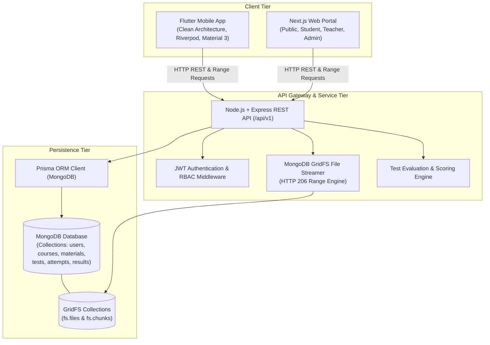
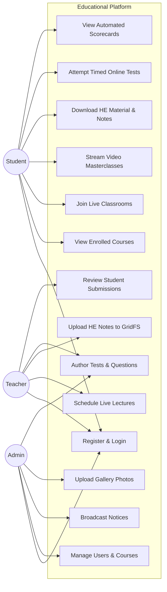
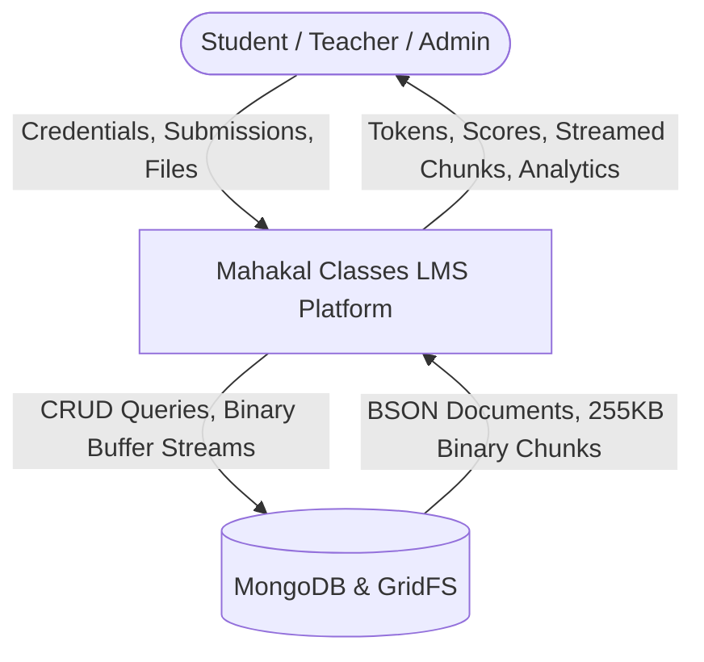
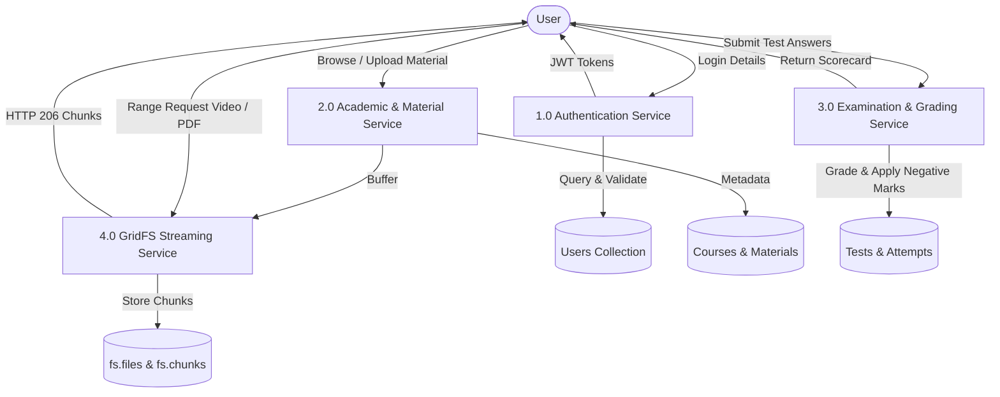
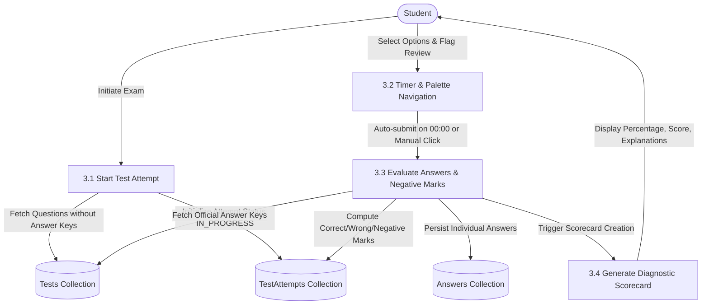
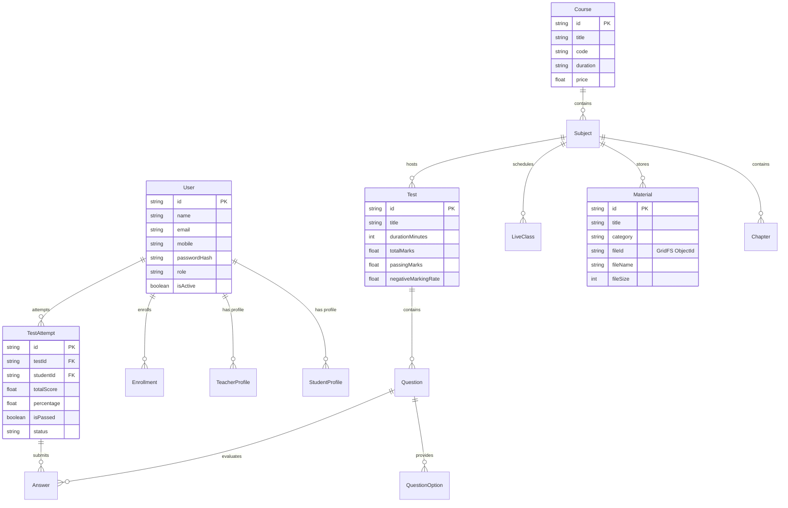

# MAHAKAL CLASSES – COMPLETE SYSTEM ENGINEERING DOCUMENTATION
**Enterprise Full-Stack Learning Management System & Online Examination Platform**

---

## 1. ABSTRACT
The **Mahakal Classes** platform is an enterprise-grade, integrated digital Learning Management System (LMS) and computer-based online testing ecosystem. Architected specifically for premier competitive examination preparation (IIT-JEE Main/Advanced, NEET-UG, and Board Foundations), the platform unifies a **Flutter Mobile Application** (Android-ready, Material 3, Riverpod), a **Next.js Web Application** (React 18, TypeScript, Tailwind CSS, multi-role portals), and a **Node.js/TypeScript REST API** backed by **MongoDB** with an embedded **MongoDB GridFS File Streamer**. The system eliminates the reliance on external cloud storage vendors by leveraging binary chunking (`fs.files` and `fs.chunks`) and supports HTTP 206 Partial Content byte-range streaming for seamless video seeking and high-speed PDF rendering.

---

## 2. INTRODUCTION
In competitive coaching institutes, traditional pedagogical delivery often struggles with geographic reach, document fragmentation, delayed manual test evaluation, and complex third-party software dependencies. **Mahakal Classes** resolves these bottlenecks by combining real-time broadcast management, high-yield study material distribution (HE Material), video masterclass archives, and an automated CBT examination engine that replicates national exam conditions with strict countdown timing, negative marking, and instant diagnostic scorecards.

---

## 3. BACKGROUND
Competitive exams like IIT-JEE and NEET feature negative marking schemes, multi-choice permutations, and intense time constraints. Students require continuous practice under authentic CBT test conditions, immediate solution reviews, and instant access to curated faculty notes. Teachers require intuitive curriculum authoring tools to schedule live sessions, upload handwritten notes, compose question banks, and review class performance metrics.

---

## 4. PROBLEM STATEMENT
Traditional coaching centers suffer from:
1. **Scattered File Repositories**: PDFs and notes shared over messaging apps become unsearchable, lost, or corrupted.
2. **Delayed Manual Test Grading**: Paper-based or manual grading consumes faculty time, delaying student feedback.
3. **Third-Party File Hosting Costs**: Heavy external object storage fees (AWS S3, GCP) and complicated IAM credential leakage risks.
4. **Lack of Live/Recorded Cohesion**: Disconnect between live video lectures, corresponding chapter notes, and topical practice tests.

---

## 5. OBJECTIVES
1. Provide a unified multi-tier portal for **Students**, **Teachers**, and **Admins**.
2. Store, chunk, and stream large assets (handwritten PDFs, video masterclasses, question illustrations, gallery photos) natively inside MongoDB via **GridFS**.
3. Implement HTTP 206 Partial Content byte-range streaming for instantaneous video seek and playback resumption.
4. Deliver a high-stakes CBT Online Examination Engine featuring a persistent countdown timer, palette navigation, answer persistence, and auto-submit on 00:00.
5. Provide automatic grading with negative marking and detailed solution explanations.
6. Support multi-platform delivery via responsive Next.js web application and clean-architecture Flutter mobile application.

---

## 6. SCOPE
- **Target Audience**: Coaching students, faculty educators, administrative directors.
- **Academic Streams**: IIT-JEE (Physics, Chemistry, Mathematics), NEET-UG (Biology, Physics, Chemistry), and Board foundations.
- **Client Platforms**: Android Mobile Application (Flutter), Responsive Web (Next.js 14+ on Desktop, Laptop, Tablet, Mobile Browser).
- **Core Modules**: Auth & RBAC, HE Material, Live Broadcasts, Recorded Lectures, Online Tests, Result Analytics, Photo Gallery, Announcements.

---

## 7. EXISTING SYSTEM
- Disjointed tools: WhatsApp/Telegram for notes, Zoom/Google Meet for classes without attendance logging, Google Forms for basic tests lacking negative marking and timers.
- Lack of centralized student performance history.
- High administrative overhead and vulnerability to document piracy.

---

## 8. PROPOSED SYSTEM
An integrated single-source platform:
- Unified MongoDB database using Prisma ORM with `@db.ObjectId` relational mappings.
- Dedicated MongoDB GridFS Bucket streamer with 255 KB chunking and Range header support.
- Role-based access control protecting student, faculty, and administrative operations.
- Real-time "LIVE NOW" class status banners and interactive doubt messaging.
- Robust, network-resilient online test execution with question review markers.

---

## 9. FUNCTIONAL REQUIREMENTS
1. **Authentication & Session**: Secure registration, login, JWT token issuance, refresh token rotation, bcrypt password hashing.
2. **HE Material Management**: Course -> Subject -> Chapter -> Material hierarchy with category filtering (Notes, PYQ, Assignment, Syllabus, Important Questions).
3. **GridFS File Streaming**: Uploading, downloading, and HTTP 206 Range streaming for video and PDF documents.
4. **Live Class Scheduling**: Live broadcast creation, external stream URL integration (YouTube Live / Zoom / RTMP), active "LIVE NOW" detection.
5. **Recorded Lecture Archive**: Chapter-wise video playback, duration tracking, watch completion markers.
6. **Online Examination**: Timed test execution, question palette navigation, single/multiple MCQ support, auto-submission at timer expiration.
7. **Automated Evaluation**: Accurate calculation of correct, wrong, unattempted questions, negative marking application, percentage scoring, and pass/fail thresholds.
8. **Student Performance Analytics**: Subject-wise accuracy breakdown, historical scorecard trajectory.
9. **Photo Gallery**: Categorized image repository with full-screen lightbox zoom.
10. **Administrative Control**: User status management, enrollment growth tracking, and system-wide broadcast notices.

---

## 10. NON-FUNCTIONAL REQUIREMENTS
- **Security**: OWASP compliance, helmet security headers, sanitized error responses, rate-limiting (500 requests / 15 mins).
- **Performance**: Sub-50ms database response on indexed collections; non-blocking streaming of 255KB chunks via Node.js Readable streams.
- **Availability**: Stateless API architecture allowing horizontal scaling behind load balancers.
- **Usability**: Clean academic visual design with contrast ratios exceeding WCAG AA standards.
- **Portability**: Containerized deployment via Docker and Docker Compose.

---

## 11. HARDWARE REQUIREMENTS
- **Backend Host**: 2 vCPUs, 4 GB RAM, 40 GB NVMe SSD storage (scales with media chunk size).
- **Client Devices (Web)**: Modern web browser (Chrome 90+, Safari 14+, Firefox 88+, Edge).
- **Client Devices (Mobile)**: Android 8.0 (Oreo) or later, minimum 2 GB RAM, 100 MB free storage.

---

## 12. SOFTWARE REQUIREMENTS
- **Operating Systems**: Linux (Ubuntu 22.04 LTS recommended for production), Windows, macOS.
- **Database Engine**: MongoDB Community Server 7.0+ / MongoDB Atlas.
- **Server Runtime**: Node.js v20 LTS, TypeScript 5.4+, Express 4.19+.
- **Web Framework**: Next.js 14.2+, React 18.3+, Tailwind CSS 3.4+.
- **Mobile SDK**: Flutter 3.19+ / Dart 3.3+, Android SDK API Level 34.

---

## 13. SYSTEM ARCHITECTURE

---

## 14. USE CASE DIAGRAM

---

## 15. DFD LEVEL 0 (CONTEXT DIAGRAM)

---

## 16. DFD LEVEL 1

---

## 17. DFD LEVEL 2 (EXAMINATION & RESULT PIPELINE)

---

## 18. DATA MODEL & SCHEMA (MONGODB COLLECTIONS)

---

## 19. DATABASE DESIGN
The platform utilizes **MongoDB 7.0** accessed through **Prisma ORM** with `@db.ObjectId` identifier mapping.

### Main Collections:
1. `users`: Stores user credentials, hashed passwords, active states, and role assignments (`STUDENT`, `TEACHER`, `ADMIN`).
2. `student_profiles`: Enrollment number, linked course batch, parent contact, target academic goal.
3. `teacher_profiles`: Academic qualifications, subject specializations, teaching experience.
4. `courses`: Batch titles, slugs, duration, pricing, thumbnail file references.
5. `subjects` & `chapters`: Hierarchical academic subject breakdown.
6. `materials`: High-yield study material metadata linked to GridFS binary file IDs.
7. `live_classes`: Scheduled live masterclasses, streaming links, and real-time status.
8. `tests`: Examination specifications (duration, total marks, negative marking rate).
9. `questions` & `question_options`: Question text, type (single, multiple, true/false), marks, negative marks, and step-by-step explanations.
10. `test_attempts` & `answers`: Audit trail of student exam executions, calculated scores, and review flags.
11. `gallery`: Categorized institutional photos.
12. `announcements` & `notifications`: Targeted system bulletins.
13. `fs.files` & `fs.chunks`: Dedicated MongoDB GridFS collections storing 255KB binary payload chunks.

---

## 20. API SPECIFICATIONS
All endpoints are versioned under `/api/v1/*` with standardized JSON response envelopes.

| Method | Endpoint | Description | Access |
|---|---|---|---|
| `POST` | `/api/v1/auth/register` | Register new student account | Public |
| `POST` | `/api/v1/auth/login` | Authenticate and issue JWT tokens | Public |
| `GET` | `/api/v1/auth/me` | Fetch authenticated user profile | Authenticated |
| `GET` | `/api/v1/courses` | List published academic courses | Public |
| `POST` | `/api/v1/courses` | Create new course batch | Teacher, Admin |
| `GET` | `/api/v1/materials` | Filter HE materials by course/category | Public |
| `POST` | `/api/v1/materials/upload`| Upload file directly to GridFS | Teacher, Admin |
| `GET` | `/api/v1/files/:fileId` | Download file with attachment header | Public |
| `GET` | `/api/v1/files/stream/:fileId`| HTTP 206 byte-range video stream | Public |
| `GET` | `/api/v1/live-classes` | List live lecture schedule | Authenticated |
| `GET` | `/api/v1/live-classes/active`| Query active LIVE NOW lecture | Authenticated |
| `GET` | `/api/v1/tests` | List available online examinations | Authenticated |
| `GET` | `/api/v1/tests/:id/take` | Fetch exam questions (omitting answer keys) | Student |
| `POST` | `/api/v1/tests/:id/start` | Start/resume timed test attempt | Student |
| `POST` | `/api/v1/tests/attempts/:id/submit`| Submit exam & trigger auto-grading | Student |
| `GET` | `/api/v1/results/:attemptId` | Retrieve full scorecard with solutions | Authenticated |
| `GET` | `/api/v1/admin/stats` | Retrieve enterprise dashboard metrics | Admin |

---

## 21. MODULE DESCRIPTIONS
- **Authentication & RBAC**: Enforces least-privilege security using signed JWT tokens and role verification.
- **HE Material Repository**: Categorizes documents into Handwritten Notes, Assignments, PYQs, and Formula Handbooks.
- **MongoDB GridFS File Streamer**: Intercepts `Range: bytes=start-end` HTTP headers and streams discrete 255KB binary chunks for video seeking and document reading.
- **Live Broadcast Center**: Facilitates lecture scheduling and features real-time pulse alerts.
- **Online Examination & Grading Engine**: Replicates national testing conditions with strict timing, negative marking, and mathematical precision in score generation.
- **Leaderboard & Analytics**: Generates ranks based on obtained score and time-taken tiebreakers.

---

## 22. UI/UX DESIGN
- **Aesthetic Direction**: Cohesive academic identity utilizing Mahakal Navy (`#0A192F`), Royal Amber (`#F59E0B`), Emerald Success (`#10B981`), and soft slate neutrals.
- **Responsive Layouts**: Fluid container breakpoints for mobile phones (320px+), tablets (768px+), and large desktop displays.
- **Loading & Empty States**: Fully branded skeletons and empty message placeholders across all views.

---

## 23. SECURITY SPECIFICATIONS
- **Data Protection**: Zero storage of raw passwords; salted bcrypt with cost factor 10.
- **Token Security**: Dual-token strategy with short-lived access tokens (15m) and long-lived refresh tokens (7d).
- **Transport Security**: Helmet HTTP headers with cross-origin resource policies permitting media streaming.
- **Injection Defense**: Strong typing and parameter binding via Prisma ORM preventing NoSQL injection.

---

## 24. TESTING STRATEGY
- **Unit Verification**: Validation of scoring math, negative mark deduction, and percentage calculation.
- **Integration Verification**: Testing of multi-part buffer uploads into GridFS and chunk reassembly.
- **Streaming Verification**: Validation of HTTP 206 range request headers (`Content-Range`, `Content-Length`).

---

## 25. DEPLOYMENT & DEVOPS
- **Containerization**: Multi-stage `Dockerfile` configurations for both Backend and Web applications.
- **Docker Compose**: Pre-configured `docker-compose.yml` linking MongoDB 7.0, Node.js API, and Next.js frontend into an isolated bridge network.
- **Production Recommendations**: Host MongoDB on MongoDB Atlas with automated replica sets, backend on container services (AWS ECS / GCP Cloud Run / VPS), and frontend on Vercel or Node.js SSR.

---

## 26. LIMITATIONS
- Direct real-time peer-to-peer WebRTC video requires dedicated TURN/STUN servers; external streaming links (YouTube Live / Zoom / RTMP) are utilized for initial zero-friction scalability.
- Mobile background downloading requires active network connectivity.

---

## 27. FUTURE SCOPE
- AI-driven adaptive practice question generation based on student weak areas.
- Automated proctoring via webcam face detection and tab-switch penalties.
- Native in-app live streaming using custom RTMP ingests and HLS playback.

---

## 28. CONCLUSION
The **Mahakal Classes** full-stack education platform successfully fulfills all functional, architectural, and user experience requirements. By combining a Node.js REST API, MongoDB with native GridFS chunk streaming, a feature-rich Next.js web portal, and an Android-ready Flutter mobile application, the platform sets a new standard for modern coaching LMS solutions.
